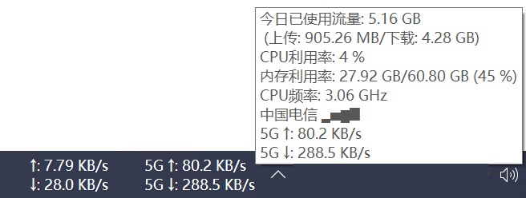

# ZTE 5G MiFi 监控插件

[TrafficMonitor](https://github.com/zhongyang219/TrafficMonitor) 插件，用于实时监控 ZTE 5G 随身 WiFi 设备状态。



## 功能

- 运营商名称及连接状态（中国电信✔ / 中国电信×）
- 信号强度（▂▄▆█ / ××××）
- 运营商 + 信号组合显示
- 上传/下载速度（自动切换 KB/s、MB/s、GB/s）
- 支持网络类型前缀（如 5G ↑: 14.3 KB/s）
- 所有显示项可通过 INI 配置文件独立开关

## 安装

1. 下载 `ZteMifiPlugin.dll`（或自行编译）
2. 将 DLL 放入 TrafficMonitor 的 `plugins` 目录
3. 重启 TrafficMonitor
4. 在任务栏右键菜单中勾选需要显示的项目

## 配置

插件会自动在 DLL 同目录下读取 `ZteMifiPlugin.ini` 配置文件。配置文件为可选项，不存在时使用默认值。

```ini
[General]
; ZTE 设备 IP 地址
DeviceIP=192.168.0.1
; 数据更新间隔（毫秒）
UpdateInterval=1000
; 调试日志开关（0=关闭, 1=开启，日志文件: ZteMifiPlugin.log）
Debug=0

[Items]
; 显示项目开关（1=启用, 0=禁用）
Operator=1
SignalStrength=1
OperatorWithSignal=1
UpDownSpeed=1
UploadSpeed=1
DownloadSpeed=1
```

### 调试日志

将 `Debug=1` 写入 INI 文件后重启 TrafficMonitor，插件会在同目录生成 `ZteMifiPlugin.log` 日志文件。

## 编译

需要 Visual Studio 2022（或 MSVC Build Tools），运行：

```bat
build.bat
```

输出文件：`build\ZteMifiPlugin.dll`

### 编译要求

- Windows 10/11
- Visual Studio 2022（需安装 C++ 桌面开发工作负载）
- C++17

### 依赖

无外部依赖。使用 Windows 内置 API：
- WinHTTP（HTTP 请求）
- Win32 API（INI 配置读写）

## 项目结构

```
include/
  PluginInterface.h    # TrafficMonitor 插件接口（API v7）
src/
  dllmain.cpp          # DLL 入口
  ZteMifiPlugin.h/cpp  # 主插件类
  ZteMifiItem.h/cpp    # 显示项目
  HttpClient.h/cpp     # WinHTTP 封装
  UrlParser.h/cpp      # JSON/URL 参数解析
  ConfigManager.h/cpp  # INI 配置管理 + 日志
  OptionsDialog.h/cpp  # 选项对话框（预留）
  OptionsDialog.rc     # 对话框资源
  resource.h           # 资源 ID
build.bat              # 编译脚本
ZteMifiPlugin.ini      # 配置文件模板
```

## 兼容设备

已测试：
- ZTE MU5120（中国电信定制版）

理论上兼容所有使用相同 Web API 的 ZTE 随身 WiFi 设备。

## 许可证

Copyright (C) 2026 neighbads
